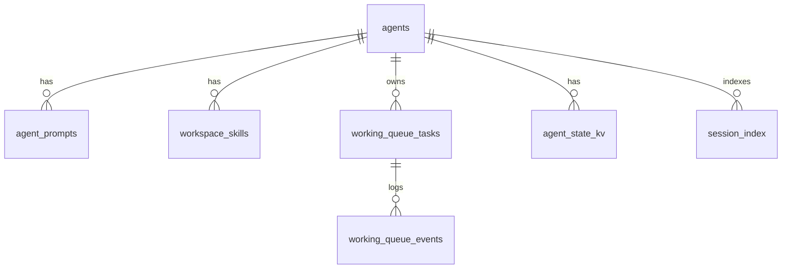

# Cơ sở dữ liệu quản lý agent, prompt, skill, state và working queue

Tài liệu này mô tả **mô hình dữ liệu đề xuất** để gom thông tin agent (tên, cấu hình), **bản sao / chỉ mục prompt**, **skill gắn workspace**, **trạng thái** và **working queue** vào một DB, thay vì chỉ dựa vào file JSON rải rác như hiện tại trong `mia` core.

## Bối cảnh hiện tại (file-based)

| Thành phần | Vị trí điển hình | Ghi chú |
|------------|------------------|---------|
| Danh sách agent runtime | `api-center/agents.json` | `id` → `workspace` tương đối repo |
| Cấu hình gateway / model / MCP | `ai-*/config/config.json` + `.env` | Đã có loader + `${ENV}` |
| Prompt bootstrap (system) | `<workspace>/AGENTS.md`, `SOUL.md`, `USER.md`, `TOOLS.md` | `ContextBuilder` đọc file; thiếu file có thể fallback template trong package |
| Skill | `<workspace>/skills/<name>/SKILL.md` (+ builtin) | `SkillsLoader` |
| Session (hội thoại) | `<workspace>/sessions/*.json` (hoặc legacy path) | `SessionManager` — payload lớn |
| Working queue | `<workspace>/working_queue/{pending,processing,done,failed,state,...}` | `WorkingQueueStore` — JSON theo task |

**Agile Studio** (MCP / API) đã có PostgreSQL cho dự án, chat, v.v. DB mới ở đây là **tầng vận hành agent Mia** (metadata + mirror/sync), có thể triển khai **SQLite** (một file trên máy dev) hoặc **PostgreSQL** (prod); schema dưới đây trung lập kiểu SQL.

## Mục tiêu DB

1. **Agent** — một dòng mỗi `agent_id` (vd. `mia-ba`), tên hiển thị, workspace root, đường dẫn config, cổng gateway (nếu lưu), `metadata` JSON.
2. **Prompt / nội dung ngữ cảnh** — bảng riêng: từng bản ghi = một “mảnh” prompt có mục đích rõ (`kind`), có thể map tới file nguồn (`source_path`) + hash nội dung để biết khi nào cần refresh.
3. **Skill (workspace)** — chỉ mục skill theo agent + workspace: tên, đường dẫn, `source` (workspace/builtin), hash `SKILL.md`, thời điểm quét.
4. **Working queue** — bảng task + (tuỳ chọn) bảng ledger sự kiện; trạng thái `pending | processing | done | failed` khớp layout hiện tại.
5. **State tổng quát** — key-value hoặc JSON theo `agent_id` + `namespace` (vd. `gateway`, `poller`, `feature_flags`).

Session **đầy đủ tin nhắn** nên **giữ file hoặc object store** lâu dài; DB chỉ nên lưu **metadata** (session_key, đường dẫn file, `updated_at`, size, hash) trừ khi bạn chủ động muốn lưu blob trong DB (tốn kém, backup nặng).

## Sơ đồ quan hệ (Mermaid)

## DDL gợi ý (PostgreSQL / tương thích SQLite)

File thực thi kèm theo: [`agent_state_schema.sql`](./agent_state_schema.sql).

### Bảng chính

- **`agents`** — `id` (PK, text), `display_name`, `workspace_root`, `config_path`, `gateway_port` nullable, `metadata` JSONB/TEXT, timestamps.
- **`agent_prompts`** — `id` BIGSERIAL, `agent_id` FK, `kind` (vd. `bootstrap_agents`, `bootstrap_tools`, `bootstrap_soul`, `bootstrap_user`, `system_rendered`, `custom`), `label` (text ngắn), `source_path` nullable, `content_sha256`, `content` TEXT nullable (hoặc chỉ hash + path nếu nội dung lớn), `updated_at`.
- **`workspace_skills`** — `agent_id` FK, `skill_name`, `skill_path`, `source` (`workspace`|`builtin`), `body_sha256`, `last_scanned_at`, PK (`agent_id`, `skill_name`, `source`).
- **`working_queue_tasks`** — khớp `WorkingQueueTaskPayload` + cột `location`, `file_name` (tên file JSON cũ nếu cần migration), `payload` JSONB, timestamps.
- **`working_queue_events`** — append-only: `task_id`, `event`, `detail` JSONB, `created_at` (thay `ledger.jsonl`).
- **`agent_state_kv`** — `agent_id`, `namespace`, `key`, `value` JSONB, `updated_at`, PK (`agent_id`, `namespace`, `key`).
- **`session_index`** (tuỳ chọn) — `agent_id`, `session_key`, `storage_path`, `message_count`, `updated_at`, `content_sha256` nullable.

## Đồng bộ từ workspace (prompt + skill)

1. **Scanner định kỳ** (hoặc hook sau khi gateway start): đọc các file bootstrap trong workspace, tính hash, `UPSERT` vào `agent_prompts` và `workspace_skills`.
2. **Không thay thế** `ContextBuilder` ngay: giai đoạn 1 chỉ **mirror** để quản trị / UI / audit; giai đoạn 2 mới đọc prompt từ DB nếu cần.

## Migration working queue

- **Song song**: mỗi lần `WorkingQueueStore` ghi file, một adapter gọi thêm `INSERT/UPDATE` DB (dual-write).
- **Chuyển hẳn**: implement `WorkingQueueStore` interface backed by SQL (giữ API `claim`, `mark_done`, …) — thay đổi lớn trong `core/mia/working_queue/`.

## Gợi ý triển khai trong monorepo

| Lớp | Gợi ý |
|-----|--------|
| Schema + migration | `api-center/db/migrations/` hoặc Alembic riêng cho `mia-ops-db` |
| Code truy cập | Package nhỏ `mia.persistence` (core) **hoặc** chỉ `api-center` nếu DB chỉ phục vụ control plane |
| SQLite dev | `MIA_AGENT_STATE_DATABASE_URL=sqlite:////path/mia_agent_state.db` |
| Prod | PostgreSQL, connection string qua env |

## Liên quan Agile Studio

Nếu dữ liệu nghiệp vụ (dự án, chat người dùng) đã nằm trong DB Agile, tránh trùng lặp: DB agent này tập trung **vận hành Mia** (prompt index, queue, session index), có thể lưu `agile_project_id` trong `agents.metadata` hoặc `agent_state_kv` để join logic ở tầng ứng dụng.

---

*Phiên bản tài liệu: đề xuất kiến trúc; triển khai code adapter là bước tiếp theo theo ưu tiên sản phẩm.*
