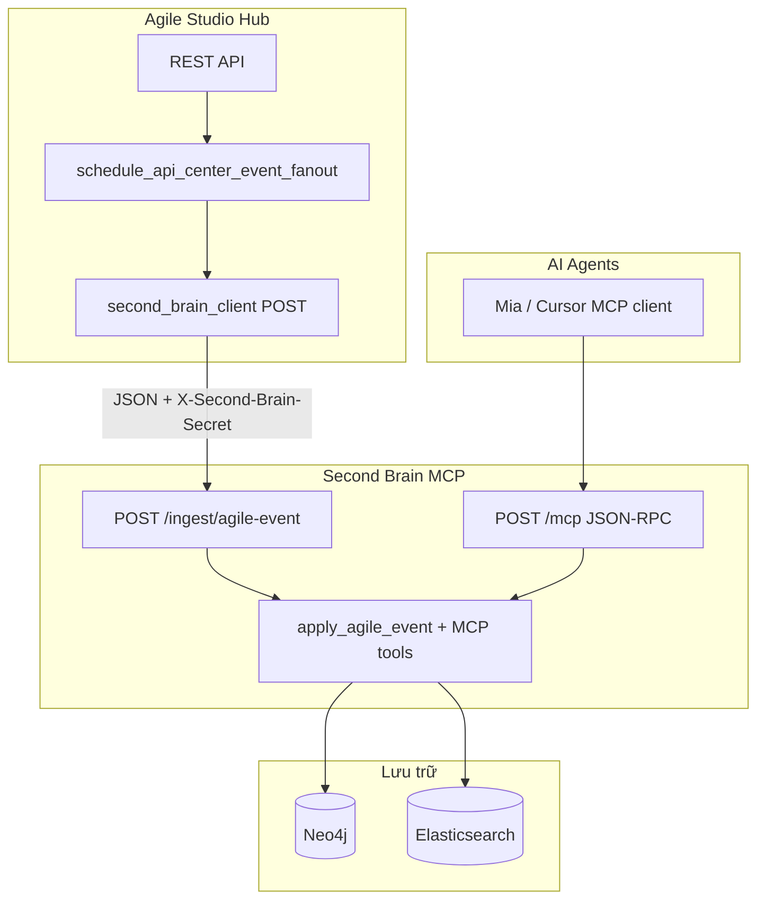

# Second Brain (Neo4j + Elasticsearch + MCP)

Service MCP độc lập: lưu **đồ thị tri thức** trong **Neo4j**, tìm kiếm vector trong **Elasticsearch** (embedding qua **Gemini Embedding API**, mặc định `text-embedding-004`, chiều vector cấu hình `SECOND_BRAIN_EMBED_DIM`), và nhận **sự kiện từ Agile Studio Hub** qua HTTP ingest.

Đặc tả kiến trúc mục tiêu (Agile + codebase intelligence + đối chiếu triển khai thực tế): [docs/PROJECT_SECOND_BRAIN_AND_CODEBASE_INTELLIGENCE.md](docs/PROJECT_SECOND_BRAIN_AND_CODEBASE_INTELLIGENCE.md).

---

## Kiến trúc & luồng dữ liệu



### 1. Ingest tự động từ Agile Studio

- Mỗi lần Hub gọi `schedule_api_center_event_fanout` (tạo/cập nhật story, comment, ticket comment, project, …), một **background task** gọi `post_agile_event_to_second_brain`.
- **Điều kiện bật:** trong môi trường Hub phải có **cả hai** biến:
  - `AGILE_SECOND_BRAIN_INGEST_URL` — ví dụ `http://second-brain-mcp:8000/ingest/agile-event` (Docker) hoặc `http://127.0.0.1:9122/ingest/agile-event` (Hub chạy host).
  - `AGILE_SECOND_BRAIN_INGEST_SECRET` — **trùng** với `SECOND_BRAIN_INGEST_SECRET` trên process Second Brain.
- Request: `POST`, `Content-Type: application/json`, header **`X-Second-Brain-Secret: <secret>`**.
- Body JSON gồm: `event_type`, `project_id`, `project_name`, `summary`, `changed_fields`, `data`.
- Trong `second_brain/ingest_agile.py`, chỉ một tập **`event_type`** được map sang MERGE Neo4j + index ES; các loại khác trả `{ "ok": true, "skipped": true }` (vẫn nhận HTTP thành công).

**Sự kiện đang được ingest (có ghi graph + ES chunk):**

| `event_type` | Ghi chú |
|--------------|---------|
| `agile_studio.project.created` | Node `:Project` |
| `agile_studio.project.updated` | Cập nhật `:Project` + ES |
| `agile_studio.project.member_added` / `member_removed` | `:Member`–`[:MEMBER_OF]`–`:Project` (xóa chỉ gỡ cạnh) |
| `agile_studio.release.created` / `updated` / `deleted` | `:Release`; `(Project)-[:CONTAINS]->(Release)` |
| `agile_studio.story.created` / `story.updated` | `:Project`–`[:HAS_STORY]`–`:Story` |
| `agile_studio.comment.created` / `updated` | `:Comment`–`[:ON]`–`:Story`, optional `Member`–`[:AUTHORED]`; ES gộp `body_preview` nếu Hub gửi |
| `agile_studio.comment.deleted` | Xóa `:Comment` + doc ES |
| `agile_studio.task_comment.*` | Tương tự, gắn `:Task` |
| `agile_studio.wiki_document.created` / `updated` / `deleted` | `:Document` (wiki), preview markdown trong `body_preview` |
| `wiki_comment_created` / `wiki_comment_updated` / `wiki_comment_deleted` | `:WikiComment`–`[:ON]`–`:Document` |
| `second_brain.git.commit` / `agile_studio.git.commit` | `:Commit`–`[:HAS_COMMIT]`←`:Project`; parse message → `(Task)-[:IMPLEMENTED_BY]->(Commit)`, `(Commit)-[:IMPLEMENTS]->(Story)` (regex env `SECOND_BRAIN_COMMIT_*`) |
| *(event Hub khác)* | POST vẫn thành công nhưng **skipped** + log INFO `event_type not mapped` |

**Lưu ý:** Hub đã gửi `body_preview` / `content_preview` cho comment story, ticket và wiki; ES nhận embedding trên text đã gộp summary + preview.

**P1–P4 (tóm tắt):**

- **P1:** Trường ES `scope`, `visibility`, `status`, `tags`; `brain_remember_decision` ghi các field này + Neo4j `Decision.scope|visibility|tags`.
- **P2:** Nhãn graph `:LessonLearned`, `:WikiComment`, `:Feedback`, `:Commit`; ingest wiki + comment có preview.
- **P3:** `brain_extract_lesson_from_text` → `lesson_extract.propose_lesson_json` (tuỳ chọn LLM qua env `SECOND_BRAIN_EXTRACT_LLM_*`).
- **P4:** `brain_feedback_create`, `brain_supersede_decision`, whitelist quan hệ `SUPERSEDES`, `DERIVED_FROM`, `PROVIDES_FEEDBACK`, …

### 2. Agent AI qua MCP

- Client MCP (Mia, Cursor, …) kết nối **`http://<host>:<port>/mcp`** (mặc định dev: `http://127.0.0.1:9122/mcp`).
- Tool chính:
  - `brain_query_graph` — Cypher **chỉ đọc** (có guard).
  - `brain_get_neighborhood` — láng giềng theo `ref`, độ sâu tối đa 3.
  - `brain_upsert_relation` — tạo cạnh (whitelist kiểu quan hệ).
  - `brain_search_knowledge` — kNN (`search_mode=vector`) hoặc **hybrid** kNN+BM25 (`search_mode=hybrid`); lọc `scope`, `visibility`, `source_type` (`agile` / `code` / `code_diff`).
  - `brain_github_compare` — Đọc diff GitHub API `compare base...head` (không ghi graph); cần token.
  - `brain_refresh_github_code` — Agent gọi để **cập nhật code space**: repo `owner/repo`, `ref` nhánh hoặc SHA, tuỳ chọn `project_id`, danh sách file (`paths_json`) hoặc quét cây Git (đuôi đã hỗ trợ) + `path_prefix`; cần `SECOND_BRAIN_GITHUB_TOKEN`.
  - `brain_remember_decision` — ADR/MADR (`:Decision`), `scope`/`visibility`/`tags_json`, optional `DECIDED_IN` → `:Story`.
  - `brain_remember_lesson`, `brain_feedback_create`, `brain_supersede_decision` (cập nhật `old.status = Superseded`),
    `brain_extract_lesson_from_text`, `brain_extract_adr_from_text`.

**Ingest GitHub:** `POST /ingest/github-webhook` — header `X-GitHub-Event: push`, ký `X-Hub-Signature-256` với `SECOND_BRAIN_GITHUB_WEBHOOK_SECRET`; cần `SECOND_BRAIN_GITHUB_TOKEN` để đọc nội dung file và map repo→`project_id` (`SECOND_BRAIN_GITHUB_REPO_PROJECT_MAP` hoặc `SECOND_BRAIN_GITHUB_DEFAULT_PROJECT_ID`). Với mỗi file được ingest: Neo4j `:CodeFunction`, `DEFINES`, `CALLS` — Python qua `ast`; JS/TS/TSX/JSX, Java, Go, HTML, CSS, Vue (khối `<script>` như TS) qua **Tree-sitter** nếu các package trong `requirements.txt` đã cài; thiếu Tree-sitter thì vẫn index nội dung file lên ES. **Diff điều tra issue:** mỗi commit (webhook hoặc `brain_refresh_github_code`) gọi GitHub API commit để lấy `patch` theo file; ghi thêm chunk ES `label=CodeDiff`, `source_type=code_diff` (tìm bằng `brain_search_knowledge` với `source_type=code_diff`). Tuỳ chọn `.env`: `SECOND_BRAIN_GITHUB_FETCH_DIFF`, `SECOND_BRAIN_GITHUB_DIFF_MAX_PATCH_BYTES`, `SECOND_BRAIN_GITHUB_DIFF_MAX_FILES`, `SECOND_BRAIN_GITHUB_DIFF_INDEX_SCOPE=touched|full_commit`. **So sánh hai ref (HTTP):** `POST /ingest/github-compare` JSON `{repository, base, head}` + header `X-Second-Brain-Secret` (cùng ingest secret).

Luồng **ADR do AI**: không tự chạy sau mỗi comment; agent phải **chủ động** gọi `brain_remember_decision` khi được yêu cầu hoặc khi workflow cho phép.

### 3. Khóa định danh nút (`ref`)

Định dạng: `p{project_id}:{kind}:{agile_id}` (ví dụ `p2:story:15`). Dùng cho MERGE và tra cứu neighborhood.

---

## Setup

### A. Docker Compose (khuyến nghị)

Trong repo gốc `mia`, [`docker-compose.yml`](../docker-compose.yml) định nghĩa:

- **neo4j** — ports `7474` (Browser), `7687` (Bolt); user/pass mặc định `neo4j` / `secondbrain_local`.
- **elasticsearch** — port `9200`, single-node dev (security tắt).
- **second-brain-mcp** — image build từ thư mục `second-brain/`, map host **`9122` → 8000** (MCP + health + ingest).
- **agile-studio** — đã gán sẵn `AGILE_SECOND_BRAIN_INGEST_URL` và `AGILE_SECOND_BRAIN_INGEST_SECRET` trùng service Second Brain.

**Embedding (Gemini):** trước `docker compose up`, export **`GEMINI_API_KEY`** trên máy host (Compose truyền vào service `second-brain-mcp`). Không có key thì ingest/search gọi embed sẽ lỗi — chỉ dev có thể đặt `SECOND_BRAIN_EMBEDDING_FALLBACK=1` trong environment của service (không khuyến nghị production).

Lệnh ví dụ:

```bash
# Từ thư mục mia/
docker compose build second-brain-mcp
docker compose up -d neo4j elasticsearch second-brain-mcp
# Kèm Hub để ingest chạy:
docker compose up -d agile-studio ...
```

Kiểm tra:

- `GET http://127.0.0.1:9122/health` — `neo4j` / `elasticsearch` = true khi backend sẵn sàng.
- MCP: `POST http://127.0.0.1:9122/mcp` (streamable HTTP theo MCP SDK).

### B. Hub chạy ngoài Docker

Trong [`agile-studio/.env`](../agile-studio/.env) thêm (xem [`EXAMPLE_.env`](../agile-studio/EXAMPLE_.env)):

```env
AGILE_SECOND_BRAIN_INGEST_URL=http://127.0.0.1:9122/ingest/agile-event
AGILE_SECOND_BRAIN_INGEST_SECRET=<cùng giá trị SECOND_BRAIN_INGEST_SECRET>
```

Nếu **không** đặt URL hoặc để secret rỗng, Hub **không** gửi ingest (an toàn mặc định).

### C. Chạy Second Brain bằng Python trên máy

1. Chạy Neo4j + ES (hoặc chỉ `docker compose up -d neo4j elasticsearch`).
2. Sao chép [`.env.example`](.env.example) → `.env` và chỉnh URI/port.
3. Cài dependency và chạy:

```bash
cd second-brain
pip install -r requirements.txt
PYTHONPATH=. python -m unittest discover -s tests -v
python -m second_brain
```

Đặt `MCP_TRANSPORT=streamable-http` trong `.env` để lắng nghe HTTP (giống container).

### D. Cấu hình Agent (Mia)

Trong `agents/ai-tech/config/config.json` và `agents/ai-ba/config/config.json`, MCP server **`second-brain`** trỏ tới `http://127.0.0.1:9122/mcp` khi agent chạy trên host.

Nếu bật **`SECOND_BRAIN_MCP_SECRET`** trên Second Brain, thêm header vào MCP client (Streamable HTTP), ví dụ:

```json
"headers": {
  "Authorization": "Bearer <cùng giá trị SECOND_BRAIN_MCP_SECRET>"
}
```

(hoặc `X-Second-Brain-MCP-Secret` với giá trị raw secret). `/health` và `/ingest/*` **không** yêu cầu secret này.

---

## Biến môi trường (Second Brain process)

| Biến | Ý nghĩa |
|------|---------|
| `NEO4J_URI` | Bolt URI (vd. `bolt://neo4j:7687` trong Docker) |
| `NEO4J_USER` / `NEO4J_PASSWORD` | Auth Neo4j |
| `ELASTICSEARCH_URL` | Base URL ES (vd. `http://elasticsearch:9200`) |
| `SECOND_BRAIN_INGEST_SECRET` | Bắt buộc để `/ingest/agile-event` chấp nhận request (so khớp header) |
| `SECOND_BRAIN_MCP_SECRET` | Tuỳ chọn; nếu đặt → chỉ `/mcp` cần Bearer hoặc `X-Second-Brain-MCP-Secret` |
| `SECOND_BRAIN_COMMIT_STORY_SLUG` | Tuỳ chọn; parse story id từ commit kiểu `{slug}-{number}` (vd. `mia-15`) |
| `SECOND_BRAIN_EMBED_MAX_RETRIES` / `SECOND_BRAIN_EMBED_RETRY_DELAY_SEC` | Retry Gemini embed khi 429 / 5xx |
| `SECOND_BRAIN_ES_INDEX` | Tuỳ chọn; mặc định `second_brain_chunks` |
| `MCP_TRANSPORT` | `stdio` hoặc `streamable-http` |
| `MCP_HOST` / `MCP_PORT` | Bind HTTP MCP |
| `MCP_STATELESS_HTTP` / `MCP_JSON_RESPONSE` | Khuyến nghị `true` cho client kiểu Cursor/SDK |

Hub (Agile): `AGILE_SECOND_BRAIN_INGEST_URL`, `AGILE_SECOND_BRAIN_INGEST_SECRET` — mô tả trong [`agile_hub/second_brain_client.py`](../agile-studio/agile_hub/second_brain_client.py).

---

## Bảo mật & production

- Đổi mật khẩu Neo4j, bật bảo mật Elasticsearch, không expose ES ra internet không cần thiết.
- Đặt **secret ingest dài, ngẫu nhiên**; không commit secret vào git.
- Khuyến nghị **`SECOND_BRAIN_MCP_SECRET`** khi MCP HTTP lộ ra ngoài mạng tin cậy (reverse proxy TLS + secret).
- `brain_query_graph` chỉ cho phép Cypher **đọc**; `brain_upsert_relation` giới hạn **kiểu quan hệ** cho phép.

---

## Cấu trúc thư mục

| Đường dẫn | Vai trò |
|-----------|---------|
| `second_brain/app.py` | FastMCP, routes `/health`, `/ingest/agile-event`, đăng ký tool |
| `second_brain/ingest_agile.py` | Map `event_type` → Neo4j + ES |
| `second_brain/neo4j_store.py` | Driver, constraint, read/write |
| `second_brain/es_store.py` | Index dense_vector 384, kNN search |
| `second_brain/embeddings.py` | Vector deterministic (khớp dim wiki Agile mặc định) |
| `second_brain/cypher_guard.py` | Chặn Cypher ghi |
