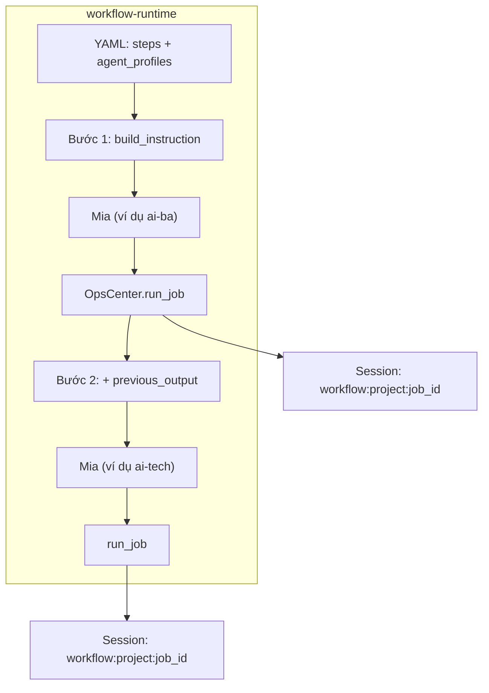
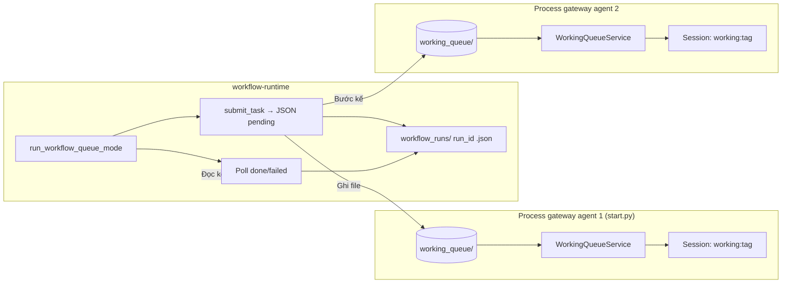

# Kiến trúc: workflow-runtime và các agent (Mia)

Tích hợp từ **client ứng dụng (Agile Studio, v.v.):** [CLIENT_INTEGRATION.md](./CLIENT_INTEGRATION.md)

Tài liệu mô tả cách **workflow-runtime** (CLI `main.py`) phối hợp với từng bộ **agent** (`ai-ba`, `ai-tech`, `ai-dev`, `ai-qc`, `ai-devops`, `ai-pm`…) — kênh hội thoại `workflow`, tùy chọn **chế độ file queue** tích hợp với `working_queue` (core mia).

## Thành phần tổng quan

| Thành phần | Vai trò |
|------------|--------|
| `workflow-runtime` | Đọc pipeline YAML, `project` id, cặp mặc định `config` / `.env`. Hai chế độ: **inline** (Mia trong cùng process) hoặc **queue** (ghi JSON vào từng agent, poll `done/`). |
| Mỗi deploy `ai-*` | `config/config.json`, `workspace/`, tùy chọn gateway (Discord) và **working queue** bật trong cấu hình mia. |
| Kênh `workflow` | `ops_center.WORKFLOW_CHANNEL` — cùng `process_direct` như các kênh khác nhưng tách `session` theo `workflow:<project>:<step>`. |
| `working_queue` (core) | `workspace/working_queue/{pending,processing,done,failed}` + **`state/`** cùng cấp: `state/summary.json` (số lượng theo phase), `state/items/<id>.json` (trạng thái + preview kết quả/lỗi), `state/ledger.jsonl` (nhật ký sự kiện). Gateway poll khi `workingQueue.enabled: true`. Session: `working:<tag_dự_án>`. |
| Webhook từ xa + Studio | `working_queue_webhook.py` (HTTP): `POST /v1/sessions` (body `secret` = `WORKFLOW_RUNTIME_CONNECT_SECRET`) → `session_key`; `GET /v1/discovery` + `POST /v1/working-queue/tasks` dùng `Authorization: Bearer <session_key>`. Xem [STUDIO_API.md](./STUDIO_API.md), [CLIENT_INTEGRATION.md](./CLIENT_INTEGRATION.md). |

## Chế độ 1: **inline** (`execution.mode: inline` hoặc mặc định)

Runtime chạy **tuần tự** từng bước **trong một tiến trình Python**; bước nào gắn `agent_profiles` tương ứng thì **nạp đúng** `Mia.from_config` + env, đóng MCP bước trước nếu đổi config (xem `workflow_yaml.py`).

- **Lịch sử** từng bước: file session dưới `workspace/sessions/` của **config** đang dùng ở bước đó (mỗi bước đổi `config` = đổi workspace theo bản cài).  
- **Không** tự động tạo process riêng từng agent — chỉ một `AgentLoop` tại mỗi thời điểm sau khi tạo lại `Mia` khi đổi config.

## Chế độ 2: **queue** (`execution.mode: queue` hoặc `--execution-mode queue`)

Runtime **không** gọi `Mia` từng bước. Với mỗi bước, nó:

1. Suy **workspace gốc** agent từ `agent_profiles` (trường tùy chọn `workspace`, hoặc `.../config/config.json` → `.../workspace`).
2. Ghi `pending/<task_id>.json` vào `workspace/working_queue/`.
3. Chờ file ở `done/` hoặc `failed/` (poll) — cần **gateway** agent đó đang chạy với `workingQueue` bật.
4. Lấy `result_excerpt` (và tích lũy) để bước kế, đồng thời cập nhật `workspace/workflow_runs/<run_id>.json`.

- Mỗi **gateway** = một process Python riêng (một bản cài `ai-*` / một cấu hình).  
- **Chat cá nhân** (ví dụ Discord) dùng session `discord:...`; công việc từ queue dùng `working:...` — tách dòng lịch sử trên cùng agent.  
- Runtime **có thể** chạy song song với chat trên cùng gateway (cùng process) — thiết kế không khóa trọn vẹn; xem thảo luận trong tài liệu core nếu cần hàng đợi nghiêm ngặt.

## Trạng thái lần chạy (queue)

- Thư mục mặc định: `workspace/workflow_runs/` (so với thư mục làm việc tại thời điểm chạy, có thể chỉnh bằng `execution.stateDir` trong YAML).
- Mỗi lần chạy: một file `<run_id>.json` — `status`, từng bước, `queue_task_id`, lỗi nếu có.
- Có thể bật cấu hình `pollIntervalS`, `maxWaitPerStepS` trong `execution` (Xem `workflow_queue_mode.py`).

## Tệp nguồn liên quan (repo `a-agents`)

| Tệp | Mô tả |
|-----|--------|
| `workflow-runtime/main.py` | CLI, `--prompt`, `--workflow` / `--request`, `--execution-mode` |
| `workflow-runtime/workflow_yaml.py` | Tải YAML, phân nhánh inline / queue, `build_instruction` |
| `workflow-runtime/workflow_queue_mode.py` | Chế độ queue: enqueue, poll, state file |
| `workflow-runtime/ops_center.py` | `WorkflowJob`, `WorkflowResult`, kênh `workflow` |
| `core/mia/working_queue/` | Lưu file JSON, `WorkingQueueService` (poll trong gateway) |
| `workflow-runtime/workflow_human_approval.py` | Phê duyệt con người: `decision.json` (approve / reject + feedback), làm lại cùng bước khi reject |

## Phê duyệt con người (`human_approval`)

- Trên từng bước (`steps[]`) thêm tùy chọn `human_approval` (object) hoặc `true` (dùng mặc định từ `human_approval_defaults` ở root YAML).
- Sau khi AI trả lời, runtime in đường dẫn tới `workspace/approvals/<run_id>/<step_id>/` và tạo `AWAITING_REVIEW.txt` + `awaiting_review.json`.
- Người duyệt tạo `decision.json`: `{"action":"approve"}` hoặc `{"action":"reject","feedback":"…"}`. Reject: cùng **role** (cùng bước) chạy lại với prompt cộng thêm khối phản hồi; bước kế chỉ chạy sau khi approve. Giới hạn lần reject: `max_reject_loops` (mặc 20).
- Hoạt động ở cả **inline** và **chế độ queue** (sau khi file `done/` xuất hiện, vẫn chờ `decision.json` trước khi bước kế / task kế).

## Điều kiện cần (tóm tắt)

- Cài mia: `pip install -e ../core` (cùng venv).  
- **Queue**: mỗi agent đích cần gateway sống, `config` có `workingQueue.enabled: true` và cùng `working_queue` subdir (mặc định tên thư mục).  
- `agent_profiles` mỗi bước phải ánh `role` tới entry có `config` (và tùy `workspace` khi cấu trúc thư mục không mặc định).
