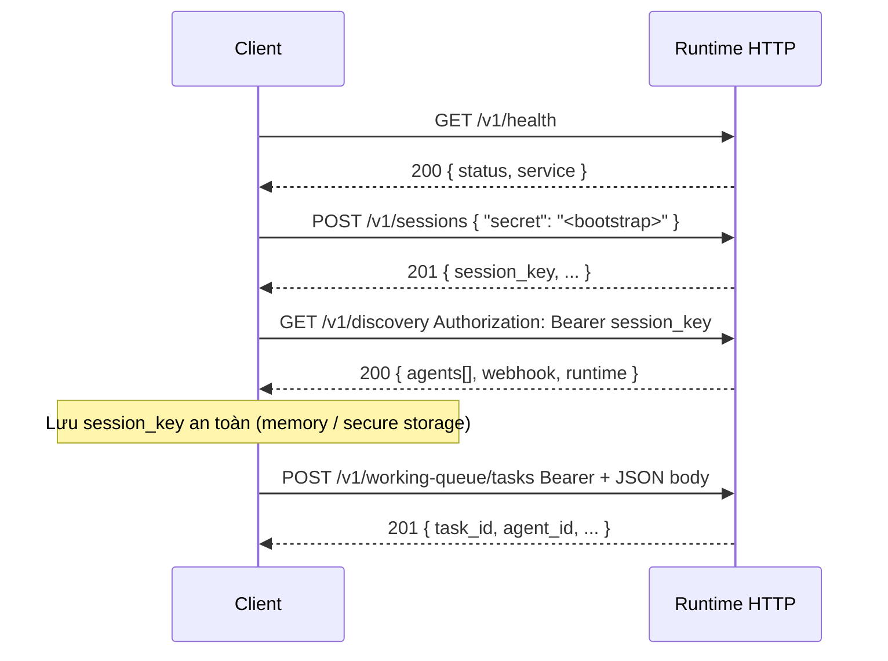

# Tích hợp client với workflow runtime (Agile Studio & automation)

Tài liệu này mô tả **luồng kết nối**, **lấy session**, **discovery**, và **gọi webhook** (`POST /v1/working-queue/tasks`) để bạn cài đặt đúng trong ứng dụng (web, desktop, service).

**Tham chiếu nhanh API:** [STUDIO_API.md](./STUDIO_API.md) · **Payload queue:** [WORKING_QUEUE_WEBHOOK.md](./WORKING_QUEUE_WEBHOOK.md) · **Kiến trúc:** [ARCHITECTURE.md](./ARCHITECTURE.md)
  
---

## 1. Điều kiện trước khi code

| Yếu tố | Ghi chú |
|--------|---------|
| **Base URL** | URL công khai tới process `working_queue_webhook.py` (ví dụ `https://runtime.example.com` hoặc `http://127.0.0.1:18880`). Nên dùng HTTPS ở production. |
| **Cấu hình phía server** | `WORKFLOW_RUNTIME_CONNECT_SECRET` (một bí mật dài, ≥ 12 ký tự); tùy chọn `WORKFLOW_RUNTIME_PUBLIC_BASE_URL` (URL mà client thấy). |
| **Map agent** | File JSON map `ai-*` → `workspace` (ví dụ `working_queue_webhook_agents.json`). |
| **Catalog (UI đẹp)** | Tùy chọn: `studio_agents_catalog.json` (tên, role, mô tả) — [studio_agents_catalog.example.json](../studio_agents_catalog.example.json). |

Client **không** cần truy cập trực tiếp tới disk `working_queue` — chỉ gọi HTTP theo tài liệu dưới.

---

## 2. Mô hình auth (một bí mật → session)

- Trên **server** chỉ cần **một** biến: `WORKFLOW_RUNTIME_CONNECT_SECRET` (không tách thêm “webhook token” riêng).
- **Client** (UI hoặc CI) gọi `POST /v1/sessions` với `{"secret": "<cùng giá trị>"}` nhận về `session_key`.
- Mọi lệnh sau (`GET /v1/discovery`, `POST /v1/working-queue/tasks`, …) dùng `Authorization: Bearer <session_key>`.  
- Nếu session hết hạn / 401, gọi lại `POST /v1/sessions` (CI có thể cache `session_key` vài giờ hoặc refresh khi 401).

---

## 3. Luồng kết nối (chuẩn)

Thứ tự gợi ý khi ứng dụng khởi động:



**Ghi chú**

1. `GET /v1/health` — không cần token; dùng kiểm tra “runtime có sống” trước khi login.
2. `POST /v1/sessions` — **không** gửi Bearer; chỉ gửi `secret` trong body — phải **trùng** `WORKFLOW_RUNTIME_CONNECT_SECRET` trên server.
3. Các bước sau: `Authorization: Bearer <session_key>` (hoặc `X-Api-Key: <session_key>`).
4. Nếu `401`: session hết hạn theo `WORKFLOW_STUDIO_SESSION_TTL_DAYS` hoặc mất dữ liệu — gọi lại bước 2.

---

## 4. Luồng discovery (sau khi đã có session)

```http
GET {BASE}/v1/discovery
Authorization: Bearer <session_key>
```

**200** — dùng để:

- Hiển thị **danh sách AI** (`agents[]`: `id`, `name`, `role`, `description`, `supported_item_kinds`, …).
- Lấy **URL webhook** chuẩn: ưu tiên `runtime.public_base_url` (và cộng path) **hoặc** dựng từ `webhook.url` nếu server trả sẵn chuỗi đủ.
- Dùng cùng header Bearer cho mọi `POST` tới `.../v1/working-queue/tasks` — **không** tạo “webhook” riêng: đó chính là **một URL HTTP** trên runtime; client chỉ cần gọi `fetch` / `HttpClient` tới URL đó.

`GET {BASE}/v1/agents` tương đương `GET /v1/discovery` (cùng nội dung).

---

## 5. Luồng tạo “webhook” (thực chất: enqueue task/notification)

Server **không** tạo URL webhook động theo từng user. Có **một** endpoint cố định:

`POST {BASE}/v1/working-queue/tasks`

**Header bắt buộc**

- `Authorization: Bearer <session_key>`
- `Content-Type: application/json`

**Body tối thiểu (rút gọn)** — [chi tiết field](./WORKING_QUEUE_WEBHOOK.md):

```json
{
  "agent_id": "tech",
  "project_id": "PRJ-42",
  "message": "Mô tả công việc hoặc thông báo",
  "item_kind": "task"
}
```

- `item_kind`: `"task"` (công việc) hoặc `"notification"` (tín hiệu/ thông báo).
- Có thể dùng biến thể `project`, `task`, `context`, v.v. như tài liệu webhook.

**201** — lưu `task_id`, `project_id`, `agent_id` để trace; xử lý nền do **gateway** agent tương ứng (cần `workingQueue.enabled: true` trên agent).

### Event-driven webhook (Agile Studio -> runtime tự route)

Nếu client chủ yếu phát sinh **event story** thay vì tự quyết định agent/message, gọi:

`POST {BASE}/v1/events/agile-story`

Header:

- `Authorization: Bearer <session_key>`
- `Content-Type: application/json`

Body ví dụ:

```json
{
  "event_type": "story.created",
  "project": { "id": "PRJ-42", "name": "Commerce Revamp" },
  "story": { "id": "ST-77", "title": "Checkout by QR", "status": "todo" },
  "metadata": { "actor": "alice@studio" }
}
```

Runtime sẽ route event -> `agent_id` theo **workflow YAML** rồi tự tạo queue item.
Bạn có thể override route bằng:

- Truyền `agent_id` trực tiếp trong payload event, hoặc
- Cấu hình server `WORKFLOW_RUNTIME_EVENT_WORKFLOW_FILE` trỏ tới file YAML rule (mặc định `workflows/agile-studio.events.workflow.yaml`).

**Lỗi thường gặp**

| Mã | Ý nghĩa | Hướng xử lý client |
|----|---------|----------------------|
| 401 | Thiếu / sai / hết hạn `session_key` | Gọi lại `POST /v1/sessions` với `secret` hợp lệ |
| 404 | `agent_id` không có trên server | Đồng bộ lại danh sách từ discovery, không hard-code id cũ |
| 400 | JSON / field thiếu | So khớp schema với WORKING_QUEUE_WEBHOOK |
| 5xx | Lỗi server / disk | Retry có backoff, cảnh báo admin |

---

## 6. Luồng tùy chọn: đăng ký quan tâm agent

Sau khi user chọn một `agent_id` (từ discovery), có thể gọi audit tùy chọn:

```http
POST {BASE}/v1/agents/{id}/register
Authorization: Bearer <session_key>
Content-Type: application/json

{ "client_id": "agile-studio", "project_key": "ORCH", "note": "sprint 12" }
```

Không bắt buộc cho việc enqueue; chủ yếu để phía runtime ghi log (xem [STUDIO_API.md](./STUDIO_API.md)).

---

## 7. Mẫu mã tối giản (fetch — trình duyệt / Node)

> Điền `BASE` và bí mật kết nối (cùng giá trị server lưu trong `WORKFLOW_RUNTIME_CONNECT_SECRET`); lưu `sessionKey` không commit lên git.

```javascript
const BASE = "https://your-runtime.example.com";

async function health() {
  const r = await fetch(`${BASE}/v1/health`);
  if (!r.ok) throw new Error("Runtime unhealthy");
  return r.json();
}

/** @returns {Promise<string>} session key */
async function createSession(connectSecret) {
  const r = await fetch(`${BASE}/v1/sessions`, {
    method: "POST",
    headers: { "Content-Type": "application/json" },
    body: JSON.stringify({ secret: connectSecret }),
  });
  if (r.status !== 201) {
    const err = await r.text();
    throw new Error(`Session failed: ${r.status} ${err}`);
  }
  const d = await r.json();
  return d.session_key;
}

async function discovery(bearer) {
  const r = await fetch(`${BASE}/v1/discovery`, {
    headers: { Authorization: `Bearer ${bearer}` },
  });
  if (!r.ok) throw new Error(`Discovery ${r.status}`);
  return r.json();
}

async function enqueueTask(bearer, body) {
  const r = await fetch(`${BASE}/v1/working-queue/tasks`, {
    method: "POST",
    headers: {
      Authorization: `Bearer ${bearer}`,
      "Content-Type": "application/json",
    },
    body: JSON.stringify(body),
  });
  if (!r.ok) {
    const t = await r.text();
    throw new Error(`Enqueue ${r.status}: ${t}`);
  }
  return r.json();
}

async function sendStoryEvent(bearer, eventBody) {
  const r = await fetch(`${BASE}/v1/events/agile-story`, {
    method: "POST",
    headers: {
      Authorization: `Bearer ${bearer}`,
      "Content-Type": "application/json",
    },
    body: JSON.stringify(eventBody),
  });
  if (!r.ok) {
    const t = await r.text();
    throw new Error(`StoryEvent ${r.status}: ${t}`);
  }
  return r.json();
}

// Gọi theo thứ tự
// const sk = await createSession(process.env.WORKFLOW_RUNTIME_CONNECT_SECRET);
// const meta = await discovery(sk);
// await enqueueTask(sk, { agent_id: "dev", project_id: "P1", message: "…", item_kind: "task" });
// await sendStoryEvent(sk, { event_type: "story.created", project: { id: "P1" }, story: { id: "ST-1", title: "..." } });
```

**CI / daemon:** thường lưu `connectSecret` secret manager; tạo session khi start hoặc trước batch, cache `session_key` tới khi 401 thì tạo lại.

---

## 8. Checklist triển khai client

- [ ] Cấu hình **một** `BASE` (staging / prod).
- [ ] Bảo vệ: HTTPS, không log `Authorization` / `secret`, secret manager cho `WORKFLOW_RUNTIME_CONNECT_SECRET` (chỉ dùng trong `POST /v1/sessions` phía client).
- [ ] Vòng đời session: xử lý 401, login lại `POST /v1/sessions`.
- [ ] UI: nạp `GET /v1/discovery` sau login để lấy danh sách AI; key ổn định là `agents[].id` khi gọi `agent_id` lúc enqueue.
- [ ] Tách rõ **task** vs **notification** (`item_kind`) nếu product có 2 loại tín hiệu.
- [ ] Không giả định “webhook URL mới mỗi lần” — path cố định `/v1/working-queue/tasks` trên `BASE`.

Nếu cần mở CORS từ trình duyệt thẳng tới runtime, cấu hình **phía reverse proxy** (cho phép origin app Agile Studio) — tài liệu runtime mặc định không bật CORS trong app Python.
